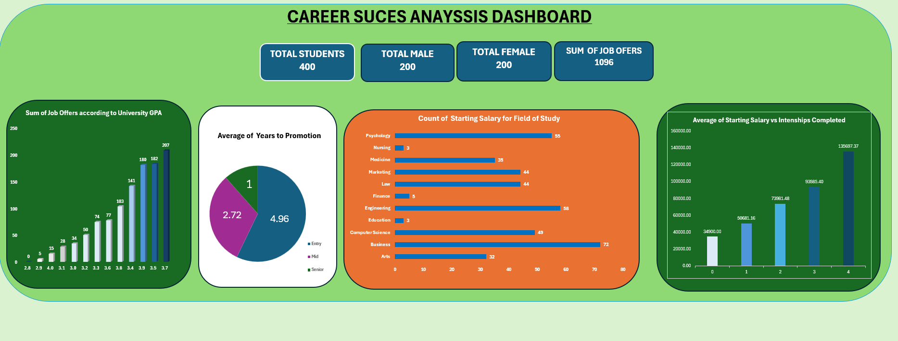

## 📊 Project 1 — Excel Data Analytics

## Student Career Outcomes Analysis

---

## 📌 Project Overview

This project applies the **8-Step Data Analytics Process** to analyze student academic backgrounds, skills, and early career outcomes using **Microsoft Excel**. The objective is to identify how factors such as academic performance, internships, skills, certifications, and work-life balance influence employability, salary, career satisfaction, and promotion timelines.

The project demonstrates practical Excel data analytics skills, including data cleaning, pivot table analysis, dashboard creation, and professional documentation suitable for a GitHub portfolio.

---

## Problem Understanding

The dataset represents students’ demographic characteristics, academic performance, skills development, and early career outcomes. It captures variables such as GPA, internships, certifications, job offers, starting salary, promotion timelines, and career satisfaction.

The dataset measures how academic achievement, experiential learning, and personal skills contribute to career success. This analysis is useful for students, educational institutions, career advisors, and policymakers seeking to understand factors that drive employability and career progression.

---

## Objectives and Analysis Questions

The main objective of this project is to analyze factors influencing student career outcomes.

**Analysis Questions:**

1. Does academic performance (GPA and SAT score) influence the number of job offers received?
2. How do internships and completed projects affect starting salary?
3. Are there differences in career outcomes across fields of study?
4. Do soft skills and networking scores relate to career satisfaction?
5. What factors are associated with faster promotion timelines?
6. Is there a relationship between work-life balance and career satisfaction?
7. Are students with certifications more likely to receive higher salaries or job levels?

---

## Data Understanding

The dataset contains **400 records and 19 variables**, including numerical and categorical data covering demographics, academics, skills, and career outcomes. Initial review focused on identifying data types, checking for duplicates, and assessing potential missing values or inconsistencies.

---

## Data Cleaning

Data cleaning was performed in Excel to ensure accuracy and consistency. The original dataset was preserved in a **Raw Data** worksheet, while all cleaning operations were conducted in a separate **Clean Data** worksheet.

Duplicate checks using `Student_ID` found no duplicate records. All columns were reviewed for missing values, and no blanks were identified. Data types were verified, column names standardized, and consistent formatting applied across numerical and categorical fields. The dataset was confirmed to be well-structured and suitable for analysis.

---

## Data Analysis

The cleaned dataset was analyzed using **pivot tables**, **sorting**, and **filtering** in Excel. Basic Excel functions including **SUM**, **AVERAGE**, **COUNT**, and **IF** were applied to compute summary statistics and support comparisons.

Pivot tables were created to analyze relationships between academic performance, internships, skills, certifications, and key career outcomes such as job offers, starting salary, career satisfaction, and promotion timelines. Each analysis was directly aligned with the objectives defined in Step 2.

---

## STEP 6 — Data Visualization (Dashboard)

An Excel dashboard was created to visually communicate the most important insights from the analysis. Selected pivot tables were converted into charts with clear titles and consistent formatting. The dashboard highlights key relationships, including academic performance and job offers, field of study and salary, internships and salary outcomes, and job level and promotion timelines.

### 📷 Dashboard Screenshot

## Insights and Recommendations

### Key Insights 

* Higher academic performance is associated with increased job offers.
* Internship experience has a strong positive effect on starting salary.
* Career outcomes vary across fields of study.
* Strong soft skills, networking, and work-life balance contribute to higher career satisfaction.
* Job level influences promotion speed, with senior roles progressing faster.
* Certifications are linked to improved salary outcomes.

### **Key Recommendations (Summary)**

* **Students** should balance academic performance with internships, skills development, and certifications.
* **Educational institutions** should expand internship programs and integrate practical learning into curricula.
* **Career advisors** should emphasize soft skills, networking, and career readiness training.
* **Policymakers** should support access to experiential learning and certification opportunities to improve employability outcomes.

---

## Tools Used

* Microsoft Excel (Data Cleaning, Analysis, Dashboard)
* GitHub (Documentation and Portfolio Hosting)

---

## ✅ Project Outcome

This project demonstrates end-to-end Excel data analytics skills, including structured analysis, dashboard creation, insight generation, and professional GitHub documentation. It serves as a complete portfolio project showcasing practical data analytics capability.

---

## 👤 Author

**Ernest Ayidenu**
Data Analyst | ICT Education
